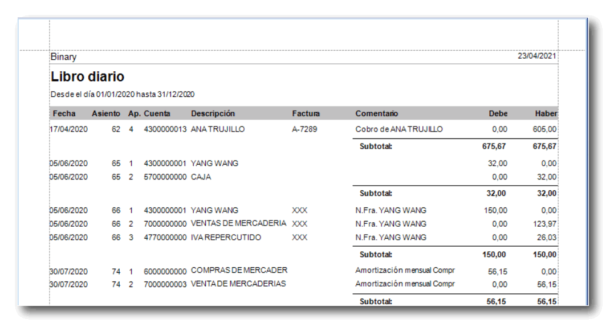

<!-- Para la unidad 2 de conta, trataré de estructurar de diferente manera, no me gustó hacerlo por fechas -->
<!-- Supongo que lo haré por temas, si no ya se me ocurrirá algo -->

# UNIDAD 2: Generalidades, catálogos de cuentas y sus clasificaciones

- [UNIDAD 2: Generalidades, catálogos de cuentas y sus clasificaciones](#unidad-2-generalidades-catálogos-de-cuentas-y-sus-clasificaciones)
  - [Balance General (Estado de Situación Financiera)](#balance-general-estado-de-situación-financiera)
    - [Fórmula del Balance General](#fórmula-del-balance-general)
  - [Estado de Resultados](#estado-de-resultados)
  - [Normas Internacionales de Información Financiera (NIIF)](#normas-internacionales-de-información-financiera-niif)
  - [Libro diario](#libro-diario)
  - [1.1 Conceptos, objetivos e importancia de la contabilidad financiera](#11-conceptos-objetivos-e-importancia-de-la-contabilidad-financiera)
    - [Aportes de Luca Paccioli](#aportes-de-luca-paccioli)

En contabilidad, las empresas tienen la obligación de registrar sus operaciones, como compras y ventas, de manera estructurada. A continuación, se presentan los conceptos clave y las clasificaciones principales dentro del balance general y el estado de resultados.

## Balance General (Estado de Situación Financiera)

El balance general es un informe financiero que muestra la situación económica de una empresa en un momento determinado. Se compone de tres elementos principales:

1. **Activo**: Recursos que generan beneficios para la empresa y que son utilizados para producir bienes o servicios.
2. **Pasivo**: Obligaciones o deudas que la empresa tiene con terceros.
3. **Patrimonio (Capital)**: La diferencia entre los activos y los pasivos, representando el valor residual de los activos de la empresa después de pagar sus deudas.

### Fórmula del Balance General

\[
\text{Activo} = \text{Pasivo} + \text{Patrimonio}
\]

## Estado de Resultados

El estado de resultados muestra el desempeño financiero de la empresa durante un período específico, reflejando los ingresos y gastos.

1. **Ingresos**: Representan las ventas o el dinero que entra a la empresa.
2. **Gastos**: Son los costos incurridos en la operación del negocio, como las compras y otros gastos operativos.

## Normas Internacionales de Información Financiera (NIIF)

Las NIIF son un conjunto de estándares internacionales diseñados para unificar la presentación de la información financiera. Se aplican tanto a pequeñas como a grandes entidades, asegurando la transparencia y comparabilidad de los estados financieros a nivel global.

Las Principales accciones de una empresa **comprar y vender**

## Libro diario

El libro diario es un registro contable donde se anotan todas las transacciones financieras de una empresa en orden cronológico. Cada transacción se registra como un asiento contable, siguiendo el principio de la partida doble, es decir, a todo cargo le corresponde un abono.

Establecido por Luca Paccioli, doble partida
A todo cargo le correspone un abono

<!-- Agrega contenido -->

## 1.1 Conceptos, objetivos e importancia de la contabilidad financiera

### Aportes de Luca Paccioli

Al inicio del año o negocio el propetario tenía que **practicar inventario** y elaborar una lista de activos y pasivos, dando prioridad al proyecto

El **Registro de operaciones** debería hacerse **De manera cronológica** en un libro denominado **Memoriale** ahora llamado **Libro diarío**.

Uso de índices cruzados para identificar las **cuentas del libro mayor.**
